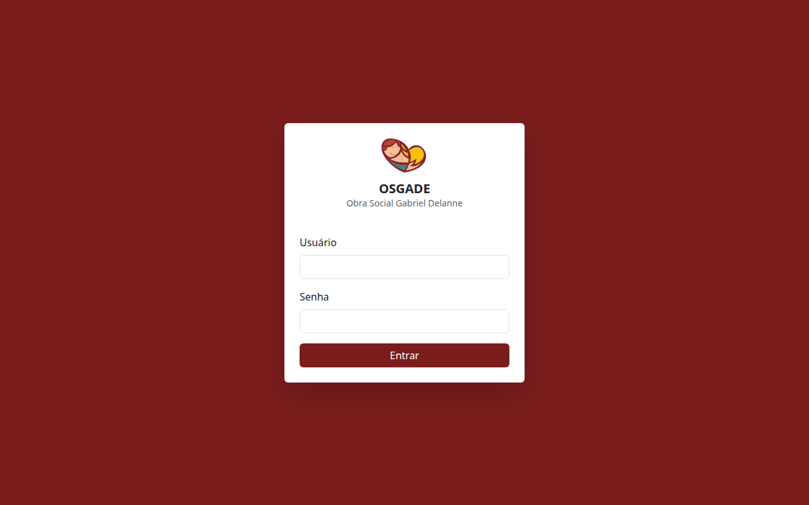
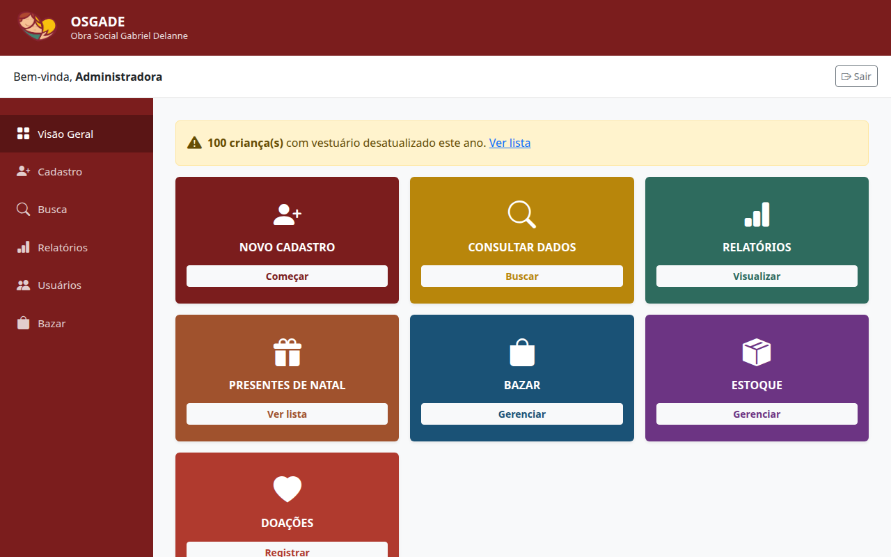

# 🏫 OSGADE — Sistema de Gestão de Crianças

Um sistema simples e seguro para gerenciar informações das crianças em creches e instituições de educação infantil.

---

## 💡 O que é?

**OSGADE** é um sistema web que ajuda educadores e administradores a:
- ✅ Cadastrar e organizar dados das crianças
- ✅ Guardar fotos e documentos importantes
- ✅ Visualizar estatísticas (quantas crianças, idades, turnos)
- ✅ Controlar quem tem acesso a quais informações
- ✅ Manter registro de todas as mudanças

---

## 🎯 Funcionalidades principais

### 📝 Cadastro simples
Preenche os dados da criança em 3 telas fáceis:
1. Dados básicos (nome, data de nascimento, turno)
2. Informações de saúde (alergias, problemas médicos)
3. Fotos e documentos (RG, vacinação, etc)

### 🔍 Busca e filtros
Encontre qualquer criança rapidamente pelo nome ou veja todas do turno da manhã/tarde/integral.

### 📊 Relatórios automáticos
Veja em um clique:
- Quantas crianças tem em cada idade
- Quem faz aniversário este mês
- Quais crianças têm alergias
- Quais documentos ainda faltam

### 🔐 Segurança e permissões
Existem dois tipos de usuários:
- **Administradora**: acesso a tudo
- **Funcionária**: vê dados básicos, mas não vê CPF nem documentos

### 📋 Histórico
Fica registrado quem alterou o quê e quando — assim nada é perdido.

---

## 🚀 Como usar

### 1️⃣ Acessar o sistema
Abra no navegador: `http://localhost:5000` (ou a URL do servidor)

### 2️⃣ Fazer login
```
Usuário: admin@osgade.local
Senha: admin123
```

### 3️⃣ Adicionar uma criança
Clique em "Nova criança" e preencha as 3 telas.

### 4️⃣ Ver relatórios
Clique em "Relatórios" para ver estatísticas.

---

## 📸 Como fica na prática

**Tela de login:**  


**Dashboard - Painel principal:**  


**Lista de crianças cadastradas:**  


---

## 💻 Para desenvolvedores

Se quiser rodar localmente para desenvolver:

```bash
python -m venv venv
source venv/bin/activate
pip install -r requirements.txt
python init_db.py
python run.py
```

Depois acesse `http://localhost:5000`

---

## 🌐 Online

Este sistema está hospedado gratuitamente no **Render**.  
Acesse: (URL será fornecida)
